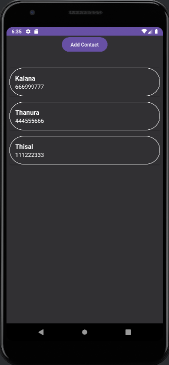

# ContactApp

A simple Android application for managing contacts using Room Database and MVVM architecture.

## Features
- Add new contacts
- View a list of saved contacts
- Update existing contacts
- Delete contacts

## Technologies Used
- Java
- Android Jetpack (ViewModel, LiveData, Room)
- RecyclerView
- MVVM Architecture

## Installation & Setup
1. Clone this repository:
   ```bash
   git clone https://github.com/yourusername/ContactApp.git

2. Open in Android Studio.

3. Build and run the application on an emulator or physical device.

## Usage
- Click the Add Contact button to add a new contact.
- Tap a contact to view Update and Delete options.
- Update the contact and save changes.
- Delete a contact if no longer needed.

## Database Structure
The system uses a Room database (`contact_database`).

## Screenshots


## License
This project is open-source and available under the **MIT License**.

## Contribution
Contributions are welcome! If you'd like to improve the project, feel free to fork the repository and submit a pull request.
